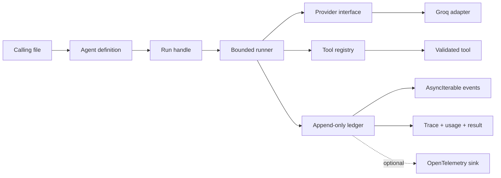
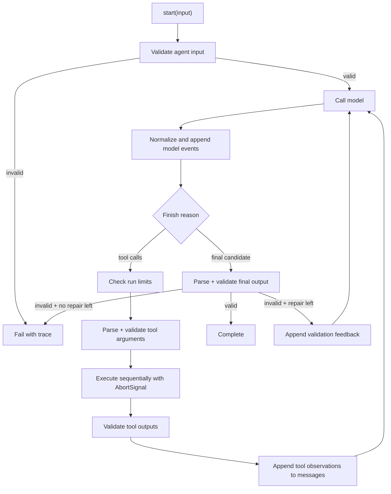
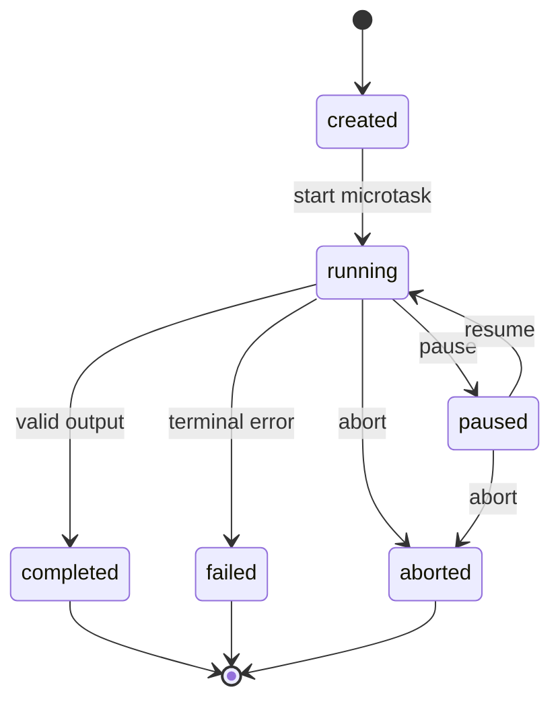

# Hog Build Quest

**A gamified design and implementation curriculum for a tiny, fast TypeScript agent framework**

- Status: approved design
- Runtime: Bun + TypeScript
- First provider: Groq
- Core dependencies already present: `groq-sdk`, `zod`, `@opentelemetry/api`
- Intended use: imported by other files in this repository
- Design date: 2026-09-08

> Your mission is to build the useful inner loop of a framework such as Mastra without building its platform. Hog runs one agent, streams typed events, calls validated tools, validates its final output, supports cooperative in-memory pause/resume, and returns an audit-quality trace with token usage.

This is a design and exercise guide, not an implementation. Every code block is a contract sketch or starter snippet. The actual implementation is deliberately left to the player.

## 1. Victory condition

A caller can define an agent, start a run, pause and resume it, observe events, and receive a validated result plus the complete trace:

```ts
const weatherAgent = createAgent({
	name: "weather-agent",
	model: groq("MODEL_ID"),
	instructions: "Answer using live weather when necessary.",
	tools: [getWeather],
	output: z.object({
		answer: z.string(),
		usedTool: z.boolean(),
	}),
	maxSteps: 6,
});

const run = weatherAgent.start({
	input: "Should I carry an umbrella?",
});

run.pause();
run.resume();

for await (const event of run.events) {
	console.log(event.type, event);
}

const result = await run.result;
console.log(result.output);
console.log(result.usage);
console.log(result.trace);
```

The call site is intentionally boring. Complexity belongs behind `start()`, not in every application that uses Hog.

## 2. Ruthless v0 scope

### Included

- One agent per run.
- Text input and text/structured output.
- A provider-neutral core with one Groq adapter.
- Streaming model and lifecycle events.
- Local tool calling.
- Zod validation for agent input, tool input, tool output, and final output.
- Sequential execution when a model proposes multiple tool calls.
- A bounded model → tool → model loop.
- Cooperative in-memory pause/resume.
- Cancellation with `AbortSignal`.
- An append-only, in-memory run trace.
- Per-model-call and whole-run input/output/total token usage.
- Optional trace sinks, including an OpenTelemetry bridge.
- Deterministic fake providers and network-free tests.

### Explicitly excluded

- Durable pause across process restarts.
- Databases, HTTP servers, queues, dashboards, and hosted services.
- Multi-agent orchestration, handoffs, graphs, and workflows.
- Long-term memory, RAG, embeddings, and vector stores.
- MCP support.
- Provider-side hosted tools.
- Parallel tool execution in v0.
- Pricing, billing, wallets, or application credits.
- Hidden chain-of-thought capture.
- Automatic provider fallback.

If a feature does not help one local agent finish one traceable run, it is probably not part of v0.

## 3. Three architecture choices

### Chosen: thin event-driven core

Hog owns a small loop and a normalized event vocabulary. Provider adapters translate wire formats at the edge. One append-only ledger powers both live events and the completed trace.

Why this wins:

- It has the smallest hot path.
- Groq types cannot leak into agent, tool, or trace contracts.
- Tests can drive the entire runtime with a fake provider.
- Pause/resume, usage aggregation, and tracing observe the same event sequence.
- A second provider requires an adapter, not a rewrite.

### Rejected for v0: Groq wrapper

Wrapping `groq-sdk` directly is initially smaller, but provider response types and quirks spread into the runner, tools, tests, and public API. Switching providers then becomes a migration rather than an adapter.

### Rejected for v0: workflow engine

A state-machine or durable-workflow engine gives stronger replay semantics, but persistence, idempotency, migrations, and recovery are unnecessary costs for an in-process playground.

## 4. Design laws

1. **Zod owns runtime truth.** TypeScript types are derived from schemas, never used as proof that external data is valid.
2. **The model proposes; Hog executes.** A model response never directly invokes a JavaScript function.
3. **The ledger is the source of truth.** Live events, the final trace, and usage totals come from one ordered event history.
4. **Provider details stop at the adapter.** The core uses normalized messages, deltas, tool calls, usage, and errors.
5. **Every loop is bounded.** A run has limits for model steps, tool calls, time, and output-repair attempts.
6. **Pause is cooperative.** It stops Hog from emitting further output or starting another operation. It does not promise to freeze Groq's HTTP request or prevent provider billing.
7. **Cancellation is terminal.** Abort does not mean pause and cannot be resumed.
8. **Missing usage is unknown, not zero.** The trace must distinguish provider-reported zero from unavailable token data.
9. **Observability must not own correctness.** A failing optional exporter cannot corrupt a run.
10. **No secret reasoning claims.** Trace observable requests, responses, decisions, calls, results, validation, timing, and usage—not private chain of thought.

## 5. Domain vocabulary

| Term | Exact meaning |
| --- | --- |
| Agent | Immutable configuration: instructions, model, tools, schemas, and limits. |
| Run | One invocation of one agent. |
| Run handle | The live control surface: events, result, status, pause, resume, abort. |
| Step | One model call and any tool calls it causes. |
| Model call | One request/response exchange with a provider. |
| Tool call | A model-proposed name, call ID, and JSON arguments. |
| Observation | The validated tool result returned to the model. |
| Ledger | Ordered, append-only `RunEvent[]` for a run. |
| Trace | A read-only snapshot/projection of the ledger. |
| Usage | Provider-reported input, output, total, and optional cached tokens. |
| Pause | A reversible, in-process gate on progression and event emission. |
| Abort | An irreversible request to end the run and cancel cooperative work. |

Use these names consistently. Avoid synonyms such as turn/step/cycle unless the distinction is defined.

## 6. System shape



### Suggested source layout

```text
src/
  index.ts
  agent.ts
  run/
    runner.ts
    run-handle.ts
    pause-gate.ts
    event-ledger.ts
    state.ts
  model/
    provider.ts
    messages.ts
    events.ts
    usage.ts
  providers/
    groq.ts
  tools/
    tool.ts
    registry.ts
    executor.ts
  output/
    validate.ts
    json.ts
  trace/
    events.ts
    sink.ts
    opentelemetry.ts
    redact.ts
  errors.ts
  testing/
    fake-provider.ts
    fixtures.ts
```

The folders are conceptual boundaries, not a file-count target. Merge tiny files until separation improves comprehension; split only when a module owns more than one reason to change.

## 7. Public contracts

These are starter shapes. They communicate responsibilities, not final implementations.

### Agent and run handle

```ts
type AgentOptions<TInput, TOutput> = {
	name: string;
	model: LanguageModel;
	instructions: string;
	input?: z.ZodType<TInput>;
	output?: z.ZodType<TOutput>;
	tools?: readonly AnyTool[];
	maxSteps?: number;
	maxToolCalls?: number;
	outputRepairAttempts?: number;
};

type RunHandle<TOutput> = {
	readonly id: string;
	readonly status: RunStatus;
	readonly events: AsyncIterable<RunEvent>;
	readonly result: Promise<RunResult<TOutput>>;
	pause(): void;
	resume(): void;
	abort(reason?: unknown): void;
};
```

`start()` begins execution on the next microtask so the caller receives the handle before events are appended. The agent definition remains immutable and reusable across concurrent runs.

### Provider seam

```ts
type LanguageModel = {
	readonly provider: string;
	readonly modelId: string;
	readonly capabilities: ModelCapabilities;
	stream(
		request: ModelRequest,
		context: ModelContext,
	): AsyncIterable<ModelEvent>;
};
```

The core must not import Groq SDK types. A provider emits normalized events such as text deltas, completed tool calls, finish information, usage, and failure.

### Tool seam

```ts
type Tool<TInput, TOutput> = {
	readonly name: string;
	readonly description: string;
	readonly input: z.ZodType<TInput>;
	readonly output: z.ZodType<TOutput>;
	execute(input: TInput, context: ToolContext): Promise<TOutput>;
};
```

The registry rejects duplicate names when the agent is created. Tool arguments are JSON-decoded and validated before `execute`. The return value is validated before it becomes a model observation.

### Result contract

```ts
type RunResult<TOutput> =
	| {
		status: "completed";
		output: TOutput;
		usage: RunUsage;
		trace: RunTrace;
	  }
	| {
		status: "failed" | "aborted";
		error: HogError;
		usage: RunUsage;
		trace: RunTrace;
	  };
```

`result` resolves to a discriminated union for expected runtime failures. Only caller misuse or an invariant violation should reject the promise.

## 8. Core execution flow



### Runner algorithm invariants

- Exactly one terminal event is appended.
- A model call is never started while paused or after abort.
- A tool is never executed before its input passes validation.
- A tool result is never sent to the model before output validation.
- Every provider call has a start and exactly one completed/failed event.
- Every provider-reported usage record belongs to exactly one model call.
- The step counter increments once per provider call.
- A repeated tool-call ID in the same run fails as an invariant violation.
- The final `RunUsage` equals the sum of all reported model-call usage, including repair calls.

## 9. Streaming and lifecycle control

### Run state machine



Repeated `pause()` or `resume()` calls are idempotent. `resume()` after a terminal state does nothing or returns a typed illegal-transition result; it must never restart work. `abort()` is idempotent.

### Cooperative pause contract

When paused:

- `run.status` changes synchronously.
- Hog appends a lifecycle event immediately.
- No new user-visible model delta or tool lifecycle event is emitted after the pause gate takes effect.
- The runner does not start a new provider call or tool execution.
- An already active Groq request may continue or buffer below Hog, so provider tokens may still accrue.
- `resume()` releases the gate and continues the same in-memory run.

Use one gate shared by the runner, provider-consumption loop, event emission, and tool boundaries. Do not implement pause by aborting the provider request; abort loses exact continuation.

### Abort contract

One `AbortController` belongs to the run. Its signal is passed to providers and tools. Abort opens the pause gate so paused work can observe cancellation, appends one terminal event, and settles `result` as `aborted`.

## 10. One ledger, two views

The `EventLedger` stores immutable events in sequence order. `run.events` is an async cursor over that ledger, and `result.trace` is a frozen snapshot of it. A late event consumer can replay from sequence 1 without maintaining a second queue.

```ts
type EventBase = {
	runId: string;
	sequence: number;
	timestamp: number;
	monotonicTime: number;
};

type RunEvent =
	| RunStartedEvent
	| RunStateChangedEvent
	| ModelStartedEvent
	| ModelTextDeltaEvent
	| ModelCompletedEvent
	| ToolInputValidationEvent
	| ToolStartedEvent
	| ToolCompletedEvent
	| OutputValidationEvent
	| RunCompletedEvent
	| RunFailedEvent
	| RunAbortedEvent;
```

Important choices:

- Use a monotonic clock for durations and wall time only for display.
- Assign sequence numbers inside the ledger, never at call sites.
- Freeze or defensively copy payloads at append time.
- Expose events as read-only data.
- Make one run's ledger independent from every other run.
- If an external trace sink fails, append a diagnostic event when safe but do not fail the agent by default.

### Trace content levels

Support a simple policy instead of always leaking content:

- `metadata`: IDs, types, models, timings, usage, sizes, and validation status.
- `full`: metadata plus prompts, deltas, tool inputs/results, and final output.
- Optional `redact(value, eventType)` before data enters the ledger.

For a local playground, `full` can be the default. Document loudly that prompts and tool results may contain secrets.

## 11. Token usage rules

Token accounting must use provider-reported values; local estimates are not authoritative.

```ts
type ModelUsage = {
	inputTokens: number | null;
	outputTokens: number | null;
	totalTokens: number | null;
	cachedInputTokens?: number | null;
	source: "provider" | "unavailable";
};

type RunUsage = {
	inputTokens: number;
	outputTokens: number;
	totalTokens: number;
	modelCalls: number;
	complete: boolean;
};
```

Rules:

- Record usage on the terminal event for each model call.
- Keep per-call usage in the trace and aggregate usage in the result.
- Include failed calls when the provider reports their usage.
- Include output-repair calls.
- `complete` is false if any provider call lacks usage.
- Never manufacture zeroes for a missing per-call field.
- Preserve provider-specific usage details under `providerMetadata` without making the core depend on them.

Groq's API reports prompt/input, completion/output, and total tokens. Cached-input details may also be present. Treat the final provider response as authoritative rather than retokenizing locally. See the [Groq API reference](https://console.groq.com/docs/api-reference) and [prompt caching guide](https://console.groq.com/docs/prompt-caching).

## 12. Structured output strategy

Zod is used twice:

1. Convert representable tool schemas to JSON Schema for the provider.
2. Validate actual tool arguments, tool returns, and final output inside Hog.

Never assume provider-side schema enforcement replaces runtime validation.

### Capability-driven modes

| Situation | v0 strategy |
| --- | --- |
| Plain text output | Aggregate normalized text deltas. |
| Structured output without tools/streaming on a capable Groq model | May use native strict JSON Schema, then still validate with Zod. |
| Structured output with streaming or tools | Prompt for JSON, parse locally, validate with Zod, and optionally make one repair call. |
| Zod schema cannot convert to JSON Schema | Fail agent creation with a clear schema-capability error, or choose local-only validation explicitly. |

Groq currently documents that streaming and tool use are unavailable with Structured Outputs. This is why `supportsStrictOutput`, `supportsTools`, and `supportsStreaming` must be independent capabilities rather than a single “supports JSON” flag. See [Groq Structured Outputs](https://console.groq.com/docs/structured-outputs).

Zod 4 converts representable schemas with `z.toJSONSchema()`, but types such as transforms, dates, bigints, maps, and custom schemas do not have a direct JSON Schema representation and throw by default. See [Zod JSON Schema](https://zod.dev/json-schema).

### Output repair

Output repair is explicit and bounded:

- Default: one repair attempt for structured output.
- Trace the invalid candidate and Zod issues according to the redaction policy.
- Send concise validation feedback, not internal stack traces.
- Count repair tokens normally.
- Never repair tool output. A tool returning data outside its declared schema is a tool failure.

## 13. Tool execution rules

1. Look up the tool by exact name.
2. Reject unknown names as a typed tool error observation or fail according to policy.
3. Parse the argument string as JSON.
4. Validate it with the tool input schema.
5. Wait at the pause gate.
6. Start a tool span/event and call `execute` with the run signal.
7. Validate the returned value with the tool output schema.
8. Serialize the validated output as the model observation.
9. Append the observation to the normalized message ledger.

Sequential execution is the v0 default even if Groq proposes several calls. It makes ordering, trace review, pause boundaries, and tests deterministic. Add controlled concurrency only after measuring a real need.

Tool errors need an explicit agent policy:

- Validation failures are returned to the model once as structured observations when recovery is useful.
- Aborts immediately end the run.
- Unknown or programmer errors fail the run by default.
- Never include raw stack traces or secrets in model observations.

## 14. Error model

```ts
type HogErrorCode =
	| "INVALID_AGENT_INPUT"
	| "PROVIDER_ERROR"
	| "PROVIDER_PROTOCOL_ERROR"
	| "UNKNOWN_TOOL"
	| "INVALID_TOOL_INPUT"
	| "TOOL_EXECUTION_ERROR"
	| "INVALID_TOOL_OUTPUT"
	| "INVALID_AGENT_OUTPUT"
	| "STEP_LIMIT_EXCEEDED"
	| "TOOL_LIMIT_EXCEEDED"
	| "TIMEOUT"
	| "ABORTED"
	| "INVARIANT_VIOLATION";
```

Every error has a stable code, human-readable message, retryability flag, safe details, and optional cause. Provider-specific errors are normalized but may preserve sanitized metadata.

Disable opaque automatic SDK retries for fully traceable attempts, or clearly document them as an exception. The Groq TypeScript SDK retries several network/HTTP failures twice by default, which would otherwise hide individual attempts from Hog's ledger. See the [official Groq TypeScript SDK](https://github.com/groq/groq-typescript).

## 15. OpenTelemetry boundary

Hog's own event types are stable and provider-neutral. OpenTelemetry is an adapter, not the internal data model.

Suggested span tree:

```text
hog.run <agent-name>
  hog.model <provider>/<model>
  hog.tool <tool-name>
  hog.model <provider>/<model>
```

Map bounded metadata such as provider, model, operation, duration, outcome, and token usage. Raw prompts, completions, tool inputs, and tool results are opt-in because they may be large or sensitive.

OpenTelemetry's GenAI conventions are evolving and recently moved to a dedicated repository. Keep all semantic-convention names in the adapter so a specification change does not change Hog's core events. See the [OpenTelemetry GenAI repository](https://github.com/open-telemetry/semantic-conventions-genai) and [GenAI attribute registry](https://opentelemetry.io/docs/specs/semconv/registry/attributes/gen-ai/).

## 16. Performance budget

“Fast” must be testable. Provider latency will dominate real runs, so measure Hog separately with a fake provider.

### Targets for the playground

- Importing the core must not instantiate Groq, exporters, global registries, or background workers.
- A text-only fake-provider run should allocate one ledger plus its event payloads, not duplicate every chunk into several queues.
- Event append should be constant time.
- Tool lookup should be constant time through a `Map` built at agent creation.
- JSON Schema conversion should happen at agent/model preparation, not for every tool call.
- Trace sinks run after the ledger append and cannot delay correctness; choose synchronous no-op/memory sinks for benchmarks.
- The benchmark suite reports p50/p95 duration, events per second, and bytes retained per run.

Do not set an impressive numeric latency goal before writing the benchmark harness. Establish the baseline first, then protect it from regressions.

## 17. Quest map

Total: **1,000 XP**. Finish levels in order; each level should leave the package runnable and its tests green.

| Level | Quest | XP | Unlock |
| ---: | --- | ---: | --- |
| 0 | Forge the contracts | 50 | Compiling public types |
| 1 | Tame the tool | 80 | Validated tools |
| 2 | Summon a fake model | 80 | Network-free provider tests |
| 3 | Build the ledger | 100 | Replayable typed events |
| 4 | Wake the runner | 90 | Text-only agent runs |
| 5 | Close the tool loop | 130 | Multi-step agent behavior |
| 6 | Open the stream | 100 | Live run events |
| 7 | Master time | 110 | Pause/resume/abort |
| 8 | Seal the output | 100 | Typed structured results |
| 9 | Count every token | 70 | Complete usage trace |
| 10 | Cross the Groq bridge | 50 | Real provider adapter |
| 11 | Defeat the final boss | 40 | Trace export + benchmarks |

---

## Level 0 — Forge the contracts · 50 XP

### Problem

Define the provider-neutral vocabulary before writing orchestration. It must compile without importing `groq-sdk` from the core.

### Starter snippet

```ts
export type RunStatus =
	| "created"
	| "running"
	| "paused"
	| "completed"
	| "failed"
	| "aborted";

export interface LanguageModel {
	// Define the smallest normalized streaming contract.
}
```

### Constraints

- Core types contain no Groq SDK types.
- Public unions are discriminated.
- Provider-specific metadata has one escape hatch.
- Agent definitions are immutable after construction.

### Success criteria

- [ ] A consumer can import all intended public types from `src/index.ts`.
- [ ] Invalid run states cannot be represented without an explicit unsafe cast.
- [ ] Two fake model instances can use the same provider contract.
- [ ] `bun run typecheck` passes.

### Test cases

1. An agent configured with two tools infers both tool input/output types without importing provider types.
2. A completed result requires validated output, usage, and trace.
3. A failed result requires an error and cannot contain successful output.

### Bonus · +10 XP

Write compile-time type tests for successful and intentionally invalid call sites.

---

## Level 1 — Tame the tool · 80 XP

### Problem

Build a tool definition and executor that treats model arguments and tool returns as untrusted data.

### Starter snippet

```ts
const add = defineTool({
	name: "add",
	description: "Add two finite numbers.",
	input: z.object({ a: z.number().finite(), b: z.number().finite() }),
	output: z.object({ sum: z.number().finite() }),
	execute: async ({ a, b }, context) => {
		// Implement the validated operation.
	},
});
```

### Constraints

- Duplicate tool names fail during agent creation.
- Invalid arguments never reach the tool function.
- Invalid returns never reach the model.
- The run `AbortSignal` is available to the tool.

### Success criteria

- [ ] Valid JSON arguments produce a validated observation.
- [ ] Malformed JSON and schema-invalid JSON produce different traceable errors.
- [ ] Tool output validation issues preserve Zod paths.
- [ ] Tool context contains `runId`, `toolCallId`, `signal`, and a trace-event helper.

### Test cases

1. `{"a": 2, "b": 3}` returns `{ sum: 5 }`.
2. `{"a": "2", "b": 3}` never calls `execute`.
3. `{not-json}` produces `INVALID_TOOL_INPUT` with a JSON parse cause.
4. A tool that returns `{ sum: "5" }` produces `INVALID_TOOL_OUTPUT`.
5. An already-aborted signal prevents the side effect.

### Bonus · +15 XP

Ensure a tool name is safe for provider function identifiers and return a useful creation-time error when it is not.

---

## Level 2 — Summon a fake model · 80 XP

### Problem

Create a deterministic provider that emits scripted normalized events. Every later runner test should work without network access.

### Starter snippet

```ts
const model = fakeModel([
	[
		{ type: "text-delta", delta: "hel" },
		{ type: "text-delta", delta: "lo" },
		{ type: "finish", reason: "stop", usage: usage(4, 2) },
	],
]);
```

### Constraints

- Each scripted call is consumed once.
- Requests are captured for assertions.
- Delays and injected errors are controllable by a fake clock.
- Abort is observable.

### Success criteria

- [ ] Tests can assert the exact normalized request sent on each model call.
- [ ] Tests can emit text, tool calls, finish data, usage, and errors.
- [ ] Asking for more calls than scripted fails loudly.
- [ ] No real timer is necessary for pause or timeout tests.

### Test cases

1. Two deltas aggregate to `hello`.
2. An abort between deltas stops the fake iterator and records cleanup.
3. A scripted provider-protocol violation is rejected by the adapter contract.

### Bonus · +10 XP

Create a reusable provider contract suite that the Groq adapter must later pass.

---

## Level 3 — Build the ledger · 100 XP

### Problem

Implement one append-only event history that supports live async iteration and a final immutable trace.

### Starter snippet

```ts
interface EventLedger {
	append(event: UnsequencedRunEvent): RunEvent;
	events(fromSequence?: number): AsyncIterable<RunEvent>;
	snapshot(): RunTrace;
	close(): void;
}
```

### Constraints

- Sequence numbers begin at 1 and never repeat.
- Consumers may subscribe before or after events exist.
- Closing wakes waiting consumers.
- Consumers cannot mutate stored events.

### Success criteria

- [ ] A late subscriber can replay the whole trace.
- [ ] A live subscriber waits without polling.
- [ ] Terminal close ends every iterator.
- [ ] Ten concurrent runs never share events or counters.

### Test cases

1. Append A/B/C, subscribe late, receive A/B/C in order.
2. Subscribe first, append later, and receive the event exactly once.
3. Close an empty ledger; a waiting `next()` finishes.
4. Mutating a received payload cannot change `snapshot()`.
5. A sink throwing an error does not corrupt sequence allocation.

### Boss mechanic

Prove that `run.events` and `result.trace.events` describe the same ordered facts.

---

## Level 4 — Wake the runner · 90 XP

### Problem

Run one text-only model call from validated input to a terminal result.

### Starter snippet

```ts
async function executeRun<TOutput>(state: RunState<TOutput>): Promise<void> {
	// Implement: validate → request → consume → complete/fail.
}
```

### Constraints

- Execution begins after `start()` returns its handle.
- The model receives system instructions and normalized user input.
- Exactly one terminal event is possible.
- Step limits are checked before a call begins.

### Success criteria

- [ ] Text deltas appear live and aggregate into the final output.
- [ ] Invalid agent input fails before the provider is called.
- [ ] Provider failure produces a failed result with a complete partial trace.
- [ ] A second concurrent run has independent messages and usage.

### Test cases

1. Fake model emits `fast`; result completes with `fast`.
2. Input schema rejects; fake model call count remains zero.
3. Provider errors after one delta; trace contains the partial delta and failure.
4. A model that never finishes is terminated by timeout/abort policy.

---

## Level 5 — Close the tool loop · 130 XP

### Problem

Implement the bounded model → tool → observation → model loop described by Groq's local tool-calling flow.

### Starter snippet

```ts
while (!state.terminal) {
	assertWithinLimits(state);
	const response = model.stream(buildRequest(state));
	// Consume the response, execute proposed tools, or finish.
}
```

### Constraints

- `maxSteps` and `maxToolCalls` are mandatory positive limits after defaults.
- Tool calls are executed in provider order.
- Tool results are correlated through stable call IDs.
- A repeated call ID is rejected.

### Success criteria

- [ ] One tool call followed by a final answer completes in two model steps.
- [ ] Multiple calls in one response execute sequentially and preserve order.
- [ ] Invalid tool input can become a safe error observation according to policy.
- [ ] A step-limit failure preserves all earlier model/tool events.

### Test cases

1. Model asks for `add(2,3)`, receives `{sum:5}`, then says `5`.
2. Model asks for an unknown tool; the configured error policy is honored.
3. Model loops forever; Hog fails before provider call `maxSteps + 1`.
4. Model repeats a tool-call ID; Hog fails before duplicating the side effect.
5. Two tool calls are returned together; the second starts only after the first completes.

### Bonus · +20 XP

Record an idempotency key in tool context even though durable replay is out of scope. This preserves a clean future seam.

---

## Level 6 — Open the stream · 100 XP

### Problem

Expose execution as a typed `AsyncIterable<RunEvent>` while preserving the same events for the final trace.

### Starter snippet

```ts
for await (const event of run.events) {
	switch (event.type) {
		case "model.text.delta":
			process.stdout.write(event.delta);
			break;
	}
}
```

### Constraints

- A caller is not required to consume events for the run to complete.
- A late consumer can replay from event 1.
- Breaking iteration releases that cursor without aborting the run.
- Event types are exhaustively switchable.

### Success criteria

- [ ] Deltas are visible before `result` settles.
- [ ] Event consumption does not change the result.
- [ ] Slow consumption does not reorder events.
- [ ] The ledger has an explicit retention limit or documents that v0 retains until result collection.

### Test cases

1. Observe the first delta while result remains pending.
2. Never iterate events; result still completes.
3. Break after one event; the run still completes and the trace remains whole.
4. Iterate after completion; receive the entire trace and then finish.

---

## Level 7 — Master time · 110 XP

### Problem

Implement cooperative pause/resume and terminal abort without pretending the network itself can be frozen.

### Starter snippet

```ts
interface PauseGate {
	pause(): void;
	resume(): void;
	wait(signal: AbortSignal): Promise<void>;
}
```

### Constraints

- Pause and resume are synchronous commands.
- The gate is checked before provider calls, tool calls, and user-visible event appends.
- Abort wakes paused waiters.
- Repeated commands are idempotent.

### Success criteria

- [ ] Pausing stops new deltas from appearing to the caller.
- [ ] Resuming continues the same run without replaying completed tools.
- [ ] Pausing between model and tool prevents the tool from starting.
- [ ] Aborting while paused settles the run promptly.
- [ ] Illegal terminal transitions never restart a run.

### Test cases

1. Pause after delta A, release provider delta B, assert B is not observed until resume.
2. Pause just before a tool; assert execution count remains zero until resume.
3. Call pause twice and resume twice; only one logical pause interval occurs.
4. Abort while paused; all waiters settle and exactly one aborted event exists.
5. Resume after completion; status and event count remain unchanged.

### Boss mechanic

Run the race test 1,000 times with a fake scheduler. There must never be a tool start after the trace says the run is paused.

---

## Level 8 — Seal the output · 100 XP

### Problem

Return a value that is both statically inferred and runtime-validated, despite provider capability differences.

### Starter snippet

```ts
const output = z.object({
	answer: z.string().min(1),
	confidence: z.number().min(0).max(1),
});

const agent = createAgent({
	// ...
	output,
});
```

### Constraints

- Successful structured output has type `z.output<typeof output>`.
- JSON parsing and schema validation are distinct traced stages.
- Repair attempts are bounded.
- Provider-native strict output is selected only when capabilities permit it.

### Success criteria

- [ ] Valid JSON matching the schema completes.
- [ ] Valid JSON violating the schema triggers one repair attempt.
- [ ] Malformed JSON and schema-invalid JSON have distinct safe diagnostics.
- [ ] Exhausted repairs fail with the original candidates preserved according to trace policy.
- [ ] Unsupported Zod-to-JSON-Schema types fail early when native schema mode is required.

### Test cases

1. `{"answer":"yes","confidence":0.8}` succeeds.
2. `{"answer":"yes","confidence":2}` triggers repair and then succeeds.
3. `not json` triggers repair and then fails when the second candidate is invalid.
4. A tool-enabled streaming run never silently selects Groq strict structured output.
5. Every repair call adds its usage to the run total.

---

## Level 9 — Count every token · 70 XP

### Problem

Track provider-reported token usage for every model call and aggregate it without hiding incomplete data.

### Starter snippet

```ts
const usage = result.usage;

// Expected shape, not implementation:
// { inputTokens, outputTokens, totalTokens, modelCalls, complete }
```

### Constraints

- Per-call usage remains in the trace.
- Aggregate usage includes normal, tool-loop, and repair calls.
- Missing usage makes the aggregate incomplete.
- Tool calls do not invent model token usage.

### Success criteria

- [ ] Usage totals equal the sum of reported call usage.
- [ ] Each usage record names the provider, model, modelCallId, and step.
- [ ] Partial failed runs return known usage.
- [ ] Missing provider usage is visibly incomplete rather than zero.

### Test cases

1. Calls `(10 in, 4 out)` and `(8 in, 2 out)` aggregate to `(18, 6, 24)` across two calls.
2. A third call with missing usage sets `complete: false` without erasing known totals.
3. A failed repair call that reports usage is included.
4. Cached-token metadata survives in the per-call trace.

---

## Level 10 — Cross the Groq bridge · 50 XP

### Problem

Translate Groq chat completions into Hog's provider-neutral request and event contracts.

### Starter snippet

```ts
const model = groq("MODEL_ID", {
	apiKey: process.env.GROQ_API_KEY,
});
```

### Constraints

- Only the adapter imports `groq-sdk`.
- SDK retries are disabled or surfaced through a traceable retry policy.
- Groq tool-call argument strings are not trusted.
- Streaming assembly handles fragmented text and tool arguments.
- Capability selection rejects unsupported mode combinations before the request.

### Success criteria

- [ ] The fake provider contract suite passes against recorded Groq fixtures.
- [ ] One opt-in live smoke test completes a text run.
- [ ] One opt-in live smoke test completes a tool loop.
- [ ] Final Groq usage is normalized into the exact Hog usage shape.
- [ ] Rate limits, auth failures, malformed responses, timeout, and abort become typed Hog errors.

### Test cases

1. Fragmented deltas reconstruct exact text.
2. Fragmented tool arguments reconstruct one JSON string and validate once complete.
3. A finish event with usage maps every available field without invented values.
4. Abort reaches the active Groq request.
5. Requesting strict schema + streaming + tools fails capability validation locally.

### Cost guard

Keep live tests behind `GROQ_API_KEY` and a separate command. The default `bun test` suite must make zero billable requests.

---

## Level 11 — Defeat the final boss · 40 XP

### Problem

Prove that Hog is observable, cheap to run, and hard to misuse.

### Starter snippet

```ts
const agent = createAgent({
	model,
	tools: [lookup, calculate],
	output: finalSchema,
	trace: { content: "full", sinks: [memorySink(), otelSink()] },
});
```

### Success criteria

- [ ] A complete run renders as an ordered timeline with model/tool nesting.
- [ ] OpenTelemetry export contains run, model, and tool spans with token attributes.
- [ ] Export failure does not change the agent result.
- [ ] A fake-provider benchmark establishes p50/p95 framework overhead.
- [ ] Trace content can be reduced to metadata or redacted.
- [ ] README quick start fits on one screen.

### Final boss scenario

The user asks a question that requires two sequential tools. Pause after the first model delta, resume, execute both tools in order, receive an invalid structured final answer, repair it once, and complete.

The winning trace must prove:

1. one legal pause interval;
2. no event leaked while paused;
3. each tool input and output passed validation;
4. no tool executed twice;
5. every model call and repair call has timing and usage;
6. aggregate tokens equal per-call totals;
7. exactly one terminal completion event exists;
8. returned output is the Zod-parsed value.

## 18. Testing pyramid

### Contract tests

- Provider contract: normalized streaming, tools, usage, errors, abort, and capability checks.
- Tool contract: input/output validation, error mapping, and cancellation.
- Ledger contract: ordering, replay, close behavior, immutability, and isolation.

### Runner scenario tests

Use scripted fake providers to test whole flows. Assert the returned result, captured model requests, tool execution counts, and exact event type sequence.

### Race tests

Use controllable deferred promises and a fake clock. Never depend on arbitrary sleeps. Exercise pause/resume/abort at every boundary.

### Live tests

Keep only a few opt-in Groq smoke tests. They confirm current wire compatibility; they should not carry most correctness coverage.

### Benchmarks

Measure separately:

- ledger append throughput;
- text-only run overhead;
- events retained per run;
- tool-loop overhead;
- Zod parse and JSON Schema conversion;
- tracing disabled, memory-only, and OpenTelemetry enabled.

## 19. Definition of done

Hog v0 is complete when all statements are true:

- [ ] A caller can switch from the fake provider to Groq without changing agent/tool definitions.
- [ ] Invalid model tool input never reaches tool code.
- [ ] Invalid tool output never reaches the model.
- [ ] Invalid final output never appears as success.
- [ ] Every run reaches exactly one terminal state.
- [ ] Pause/resume tests cover model, event, and tool boundaries.
- [ ] Aborting a paused run cannot deadlock.
- [ ] Every model call is visible with latency and provider-reported usage.
- [ ] Run token totals are derivable from the trace.
- [ ] Traces are ordered, immutable, replayable, and redaction-aware.
- [ ] Core tests run without network access.
- [ ] Groq capability mismatches fail before spending tokens.
- [ ] Framework overhead has a reproducible benchmark baseline.
- [ ] The core has no dependency on Groq types or OpenTelemetry conventions.
- [ ] No database, server, workflow graph, or multi-agent feature slipped into v0.

## 20. Future expansion map

Do not implement these during v0. The chosen boundaries leave room for them:

1. **Second provider:** prove neutrality with one adapter that is not OpenAI-wire-compatible.
2. **Durable suspend/resume:** add a checkpoint store, serializable normalized message ledger, stable tool-call identities, and replay-safe/idempotent side-effect rules.
3. **Controlled parallel tools:** add explicit concurrency and ordering policies plus cancellation semantics.
4. **Trace persistence:** JSONL or SQLite sink outside the runner.
5. **Budgets:** token/cost guards based on completed usage plus conservative preflight limits.
6. **Memory:** add as a context/message adapter, not hidden mutable runner state.
7. **MCP:** adapt MCP tools into Hog's existing `Tool` contract.

Durable execution is not “save the JavaScript object.” It requires stable step identities, serializable state, deterministic replay boundaries, and idempotent external effects. The [AWS durable execution concepts](https://docs.aws.amazon.com/lambda/latest/dg/durable-basic-concepts.html) and [step design guidance](https://docs.aws.amazon.com/durable-execution/patterns/best-practices/step-design/) are useful future references.

## 21. Reading list

### Build against these

- [Groq text generation and streaming](https://console.groq.com/docs/text-chat)
- [Groq local tool calling](https://console.groq.com/docs/tool-use/local-tool-calling)
- [Groq API reference](https://console.groq.com/docs/api-reference)
- [Groq Structured Outputs](https://console.groq.com/docs/structured-outputs)
- [Official Groq TypeScript SDK](https://github.com/groq/groq-typescript)
- [Zod basics and safe parsing](https://zod.dev/basics)
- [Zod JSON Schema conversion](https://zod.dev/json-schema)
- [ECMAScript async iterator interface](https://tc39.es/ecma262/2025/multipage/control-abstraction-objects.html#sec-asynciterator-interface)
- [Bun fetch and cancellation](https://bun.sh/docs/runtime/networking/fetch)
- [WHATWG Streams backpressure](https://streams.spec.whatwg.org/#backpressure)
- [OpenTelemetry GenAI semantic conventions](https://github.com/open-telemetry/semantic-conventions-genai)

### Papers worth reading

- [ReAct: Synergizing Reasoning and Acting in Language Models](https://arxiv.org/abs/2210.03629) — the reasoning/action/observation loop that motivates a bounded model/tool cycle. Hog should trace observable actions and observations without promising private reasoning traces.
- [Toolformer: Language Models Can Teach Themselves to Use Tools](https://arxiv.org/abs/2302.04761) — why tool selection, argument construction, and incorporating results matter; Hog supplies the deterministic validation and execution half.

### Companion research note

See [`docs/research/hog-primary-sources.md`](./research/hog-primary-sources.md) for the primary-source findings and design implications behind this specification.

## 22. Final rule

Hog succeeds by being explicit, not large. Build the loop, prove every boundary, record every observable fact, measure overhead, and stop. A small framework with precise semantics is more useful than a miniature platform with ambiguous behavior.
