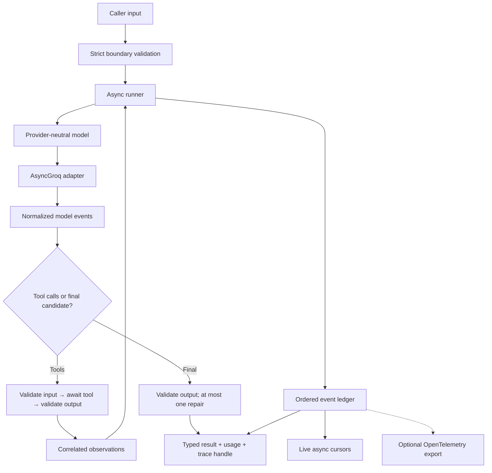

# Python Build Quest — Hog, fast and memory-aware

This is the Python track for the same Hog v0 requirements. The TypeScript track remains independent; choose one language or build both to compare the same scenario fixtures.

**Design only:** starter contracts, problem statements, constraints, examples, and success criteria. No framework implementation or solutions are provided. Requirements are normative; performance numbers below are proposed targets, not measured results.

## Python mission

Build a small, importable Python library that runs one agent, calls validated tools, streams typed events, validates final output, pauses/resumes cooperatively, and returns every observable model/tool interaction with per-call and total token usage.

Prioritize low framework overhead and bounded working memory. Provider latency, model speed, HTTP buffers, final-output size, and caller-owned objects remain separate costs.

## Game rules

- Baseline: CPython 3.11+ and `asyncio`. Pin the Python and dependency versions you benchmark.
- Runtime dependencies: `groq` and Pydantic v2. OpenTelemetry is optional.
- Use Pydantic Validation, not the Pydantic AI agent framework: this quest is about building the small agent loop yourself.
- Tests: standard-library `unittest`, including `IsolatedAsyncioTestCase`.
- Default tests must make zero network calls and spend zero tokens.
- Write tests first. Each level earns XP only when all its gates and previous levels pass.
- Use the fake model until Level 6.
- Keep CPU-bound/blocking functions off the event loop. V0 tools are asynchronous and cooperatively cancellable.
- No database, web server, durable execution, multi-agent system, memory/RAG subsystem, MCP, or billing engine.
- Do not add `uvloop`, `orjson`, `msgspec`, custom pools, or a second HTTP library until a reproducible profile identifies a bottleneck they solve.
- Starter snippets are incomplete API sketches, not copy-paste runnable solutions.

## XP map

| Level | Mission | XP | Unlock |
| --- | --- | ---: | --- |
| 0 | Define the Python agent contract | 80 | Validated immutable definitions |
| 1 | Build the deterministic async fake model | 100 | Network-free scenarios |
| 2 | Validate and execute tools | 140 | Safe Python tool calls |
| 3 | Run the bounded agent loop | 180 | Model → tool → model |
| 4 | Build the memory-aware event ledger | 140 | Streaming, complete trace, usage |
| 5 | Pause, resume, abort, and clean up | 160 | Predictable lifecycle control |
| 6 | Structured output, Groq, and performance boss | 200 | Complete Hog Python v0 |
| Total | All mandatory gates | 1,000 | Hog Python finisher |

## Victory condition

### Caller-facing contract sketch

```python
from pydantic import BaseModel, ConfigDict, TypeAdapter
from hog import create_agent
from hog.testing import fake_model


class Answer(BaseModel):
    model_config = ConfigDict(strict=True, extra="forbid")
    answer: str
    used_tool: bool


answer_adapter = TypeAdapter(Answer)  # Build once, reuse across runs.

agent = create_agent(
    name="weather-agent",
    instructions="Use the weather tool for current conditions.",
    model=fake_model(...),
    tools=(get_weather,),
    output=answer_adapter,
    max_steps=6,
)


async def demo():
    run = agent.start("Should I carry an umbrella?")
    trace = None
    try:
        run.pause()
        run.resume()
        async for event in run.events:
            print(event.kind)
        result = await run.result()
        trace = result.trace
        if result.status == "completed":
            print(result.output.answer)
        print(result.usage)
        async for event in result.trace.iter_events():
            print(event.sequence, event.kind)
    finally:
        await run.aclose()
        if trace is not None:
            await trace.aclose()
```

`start()` requires a running event loop. It returns a handle before executing the first model step. Preserve this contract even with an eager task factory by deferring execution through the loop; do not change the application's global task factory.

The Python spelling is `await run.result()` rather than TypeScript's `await run.result`. Both mean one eventual terminal result. Calling `result()` more than once returns the same outcome; cancelling one waiter must not cancel the underlying run unless the caller invokes `abort()`.

## Language mapping

| TypeScript concept | Python choice |
| --- | --- |
| Zod external contracts | Pydantic v2 `TypeAdapter` / strict `BaseModel` |
| `AsyncIterable` | `AsyncIterator` / `async for` |
| AbortController/signal | Run-owned task cancellation with `try/finally` cleanup |
| Pause gate | `asyncio.Event` plus explicit lifecycle status |
| Immutable event shell | Frozen, slotted standard-library dataclass |
| Discriminated result | Typed completed/failed/aborted variants |
| Tool registry | A `dict` built at agent creation |
| Trace snapshot | A read-only trace handle, not a duplicated event list |
| Monotonic clock | `time.perf_counter_ns()` or event-loop monotonic time |
| Groq adapter | Reusable `AsyncGroq`, isolated from the core |
| Bun test | `python -m unittest` |

Pydantic recommends reusing adapters and generally validating JSON directly rather than parsing into a Python dictionary first. This design applies those recommendations at external boundaries, not to every internal text delta. See [Pydantic performance guidance](https://docs.pydantic.dev/latest/concepts/performance/).

## Architecture and flows

Keep the same thin architecture: agent definition → run handle → bounded runner → provider/tool boundaries → one event ledger → live events and completed trace.



### Flow A — Prepare the agent

**Goal:** reject invalid configuration before a paid request.

Validate names, instructions, limits, duplicates, schema compatibility, and required provider capabilities. Build the registry, validators, and provider-facing JSON Schema once. Store tools as a tuple and expose registry/configuration through read-only views.

### Flow B — Execute a model step

**Goal:** one provider call becomes one observable step.

Wait at the pause gate → check limits → record `model.started` → consume normalized deltas/tool proposals → record finish, duration, and usage. Close the provider iterator in `finally`; do not retain SDK response objects in run state.

### Flow C — Execute tools

**Goal:** model-proposed JSON cannot bypass validation or execute an arbitrary function.

Find the declared name → check payload size → validate argument JSON → wait at the gate → record start → await execution → validate return value → record output → append a correlated observation. Execute multiple proposals sequentially, in provider order.

### Flow D — Finish structured output

**Goal:** success contains the parsed typed value, never unvalidated text.

Validate the candidate → on failure record a safe diagnostic → optionally ask for one correction → count its usage → validate again → complete or fail. The parser is pure; the runner owns the repair model call.

### Flow E — Control execution

**Goal:** pause preserves continuation; abort ends it.

Pause changes status and closes the gate. Resume opens it. Abort records intent, releases waiters, and cancels the run-owned execution task. Lower-level coroutines clean up and propagate cancellation; the handle's completion layer records the terminal result.

### Flow F — Trace and replay

**Goal:** every observable fact has one identity and sequence.

The primary ledger assigns the sequence, owns immutable data, tracks usage, and supplies cursors. Optional exporters observe that ledger. Final results reference it without copying or eagerly loading its full contents.

## Hard performance and memory truths

### Complete trace is not free

You cannot retain an arbitrarily long, complete trace in RAM while also claiming constant memory. `slots=True`, async generators, and streaming do not change that lower bound.

Use two explicit policies with the same caller-facing trace handle:

1. **Bounded in-memory trace — v0 default.** Store the full run up to a declared byte/event budget. Fail clearly before overflow; never silently truncate. Best for the cheap local playground.
2. **File-backed trace — implement only when the default ceiling is reached.** Append ordered JSONL records to a local spool, keep only a bounded active window, and replay through cursors. This is trace storage, not durable pause/resume. The result holds a reference, not all events.

An authoritative trace write failure must be visible and make `trace_complete=False`; continuing while claiming a complete trace is forbidden. Optional OpenTelemetry failures are different: they cannot corrupt the primary ledger or own correctness.

### Proposed default limits

These are starting settings, not universal optimums:

- `max_steps=6`, `max_tool_calls=12`, `max_output_repair_attempts=1`.
- Whole-run deadline: 120 seconds of monotonic elapsed time, including paused time. Provider operation deadline: 30 seconds; tool deadline: 15 seconds. These are configurable safety limits, not provider defaults.
- Input: 64 KiB UTF-8; assembled tool arguments: 64 KiB.
- Validated tool result: 256 KiB serialized; final text/JSON candidate: 1 MiB.
- Normalized conversation history: 2 MiB serialized.
- In-memory trace: 8 MiB encoded payload budget **and** a finite event-count limit, initially 20,000 events. Include object overhead in benchmarks rather than calling this an RSS cap.
- Reserve room for one terminal event and a compact overflow diagnostic.
- If file-backed mode is added: 256 KiB active payload window, finite pending-write budget, and 64 MiB spool cap initially.
- Never use `asyncio.Queue(maxsize=0)` for a push-based export pipeline; it is unbounded. An item cap alone also does not cap bytes.

Trace content is full for the local playground by default: normalized requests, returned text, tool inputs/results, validation outcomes, errors, timing, and usage. Redact before storage. An explicitly selected metadata-only mode omits content; label that mode in the trace rather than calling it full-content capture.

**Do not silently drop deltas, tool results, or usage.** On overflow, fail with the relevant stable limit code and preserve the recorded prefix plus terminal outcome. Change a limit explicitly if the application accepts larger outputs.

### Working-memory budget

For file-backed mode, target working memory proportional to:

`active message bytes + current output bytes + current tool bytes + active trace window + subscriber state`

It must not also retain the whole exported event history, every historical SDK object, a duplicate snapshot, or an in-memory offset for every event. Replay can be sequential or use a sparse on-disk index; a cursor must not materialize all records.

Returning a giant Python string inherently retains that string. Low trace memory does not make final output or model conversation memory constant.

### Hot-path rules

- Build/reuse `TypeAdapter` and JSON Schema at preparation time.
- Validate once at each semantic trust boundary. Internally generated deltas/events use plain typed records after normalization.
- Prefer flat frozen/slotted dataclasses for frequent internal events; nested mutable payloads still need ownership or canonical immutable encoding.
- Do not `deepcopy()` the whole history, `dataclasses.asdict()` each streamed event recursively, or dump/revalidate already-trusted internal records.
- Collect chunks in a bounded builder and join once; do not repeatedly concatenate the entire growing answer.
- Accumulate fragmented tool arguments by call ID; size-check before parsing and discard fragments once assembled.
- Reuse one async HTTP client per application/adapter lifetime, not per step or tool call.
- No task per token. A small fixed number of tasks per run is acceptable; record and test ownership.
- Trace errors as bounded safe data, not live exceptions with tracebacks that retain frames, SDK responses, and whole run histories. Cap diagnostic payloads too.
- No blocking SDK calls or file I/O in the event loop. Optional spool writes may be batched off-loop using standard-library facilities with bounded pending data.
- Backpressure may slow progression; it does not stop Groq from charging for an in-flight request.
- `slots` and a different event loop are hypotheses to benchmark, not a speed guarantee.

Standard-library dataclasses support slots, but frozen instances do not recursively freeze their members. See [Python dataclasses](https://docs.python.org/3.11/library/dataclasses.html) and [Python data model slots](https://docs.python.org/3.11/reference/datamodel.html#slots).

## Suggested minimal project layout

```text
hog/
  __init__.py           public exports only
  agent.py             configuration + preparation
  contracts.py         model/tool/result records + stable errors
  runner.py            bounded execution loop
  tools.py             registry + validated execution
  ledger.py            authoritative events + cursors + usage
  control.py           handle + pause/cancellation ownership
  output.py            pure output validation
  providers/
    groq.py            only Groq SDK import location
  testing.py           fake model + deterministic scheduler gates
tests/
  test_level_0_contracts.py
  test_level_1_fake_model.py
  test_level_2_tools.py
  test_level_3_runner.py
  test_level_4_ledger.py
  test_level_5_control.py
  test_level_6_output_groq.py
```

Optional only when required: `trace_spool.py`, `otel.py`, and a benchmark script. Do not create one class/file per event or a dependency-injection framework.

## Level 0 — Define the Python agent contract · 80 XP

### Problem statement

Create a safe reusable agent definition. At this level it does not call a model or execute a tool.

### Why this is required

Misconfigured limits, duplicate tool names, mutable configuration, and schema surprises should fail before tokens are spent. Python annotations alone do not validate external data.

### Requirements

- Define agent options, model capabilities, limits, and stable errors.
- Validate creation-time configuration synchronously.
- Normalize tool collections to tuples; protect nested configuration, not just the dataclass shell.
- Store reusable typed adapters. Default text output needs no structured schema.
- Reject zero, negative, fractional, non-finite, and boolean limit values. Python's `bool` being an `int` must not accidentally make `True` a valid limit.
- Keep core modules free of `groq` imports.

### Starter skeleton

```python
from dataclasses import dataclass
from typing import Generic, TypeVar
from pydantic import TypeAdapter

InputT = TypeVar("InputT")
OutputT = TypeVar("OutputT")


@dataclass(frozen=True, slots=True)
class AgentOptions(Generic[InputT, OutputT]):
    name: str
    instructions: str
    model: "LanguageModel"
    input: TypeAdapter[InputT] | None = None
    output: TypeAdapter[OutputT] | None = None
    tools: tuple["Tool", ...] = ()
    max_steps: int = 6
    max_tool_calls: int = 12


def create_agent(
    *,
    name: str,
    instructions: str,
    model: "LanguageModel",
    input: TypeAdapter[InputT] | None = None,
    output: TypeAdapter[OutputT] | None = None,
    tools: tuple["Tool", ...] = (),
    max_steps: int = 6,
    max_tool_calls: int = 12,
):
    """Validate, prepare reusable contracts, return the definition."""
    ...
```

The public API uses keyword arguments. `AgentOptions` is the prepared internal record; it is not a second public creation path. Add the other documented limit fields to that record in your implementation.

### File ownership

- `agent.py`: validation, defaults, preparation, immutability.
- `contracts.py`: types and error codes, no runtime orchestration.
- `__init__.py`: deliberate exports only.
- `tests/test_level_0_contracts.py`: accepted/rejected configurations.

### Input → expected output examples

1. Valid name/instructions/model → accepted with `6` steps and `12` tool calls.
2. Empty/whitespace-only name → `INVALID_AGENT` before a run exists.
3. Empty instructions → `INVALID_AGENT`.
4. `max_steps` in `(0, -1, 1.5, True)` → `INVALID_LIMIT`.
5. Two tools named `search` → `DUPLICATE_TOOL_NAME`.
6. Mutate the caller's tool list/configuration after creation → prepared agent remains unchanged.
7. `TypeAdapter(Answer)` as output contract → typed `Answer` is preserved for later runtime validation, with no provider call now.

### Passing criteria

- [ ] All seven cases pass and errors have stable actionable codes.
- [ ] Validators and provider-facing schemas are not rebuilt per run.
- [ ] Agent preparation creates no sockets, tasks, or exporter workers.
- [ ] Core has no provider SDK imports.
- [ ] `python -m unittest discover -s tests -p 'test_level_0*.py'` passes.

### Level boss

Create 20 invalid definitions, including nested caller mutation and `bool` limits. Every one must fail before any network or side effect.

### Resources

- [Pydantic TypeAdapter](https://docs.pydantic.dev/latest/concepts/type_adapter/)
- [Pydantic strict mode](https://docs.pydantic.dev/latest/concepts/strict_mode/)
- [Python dataclasses](https://docs.python.org/3.11/library/dataclasses.html)

## Level 1 — Build the deterministic async fake model · 100 XP

### Problem statement

Create an async provider-neutral model and a scripted fake. It is your zero-cost laboratory for every later scenario.

### Why this is required

Network timing is not a test scheduler. Controlled async gates let you reproduce fragments, errors, cancellation, and races without arbitrary sleeps.

### Requirements

- Use a narrow `Protocol` or typed callable seam; provider neutrality is explicitly required, not speculative abstraction.
- Emit normalized text/tool/finish/usage records.
- Capture requests using owned snapshots rather than references that later mutate.
- Reserve each script deterministically before the first await.
- Model delays with controllable futures/events.
- Release resources on cancellation and async-iterator close.
- Require a terminal finish or failure; early iterator exhaustion is a protocol error.

### Starter skeleton

```python
from collections.abc import AsyncIterator
from typing import Protocol


class LanguageModel(Protocol):
    provider: str
    model_id: str

    def stream(self, request: "ModelRequest") -> AsyncIterator["ModelEvent"]:
        ...


def fake_model(scripts: tuple[tuple["ModelEvent", ...], ...]) -> LanguageModel:
    """Capture requests; emit one reserved script per call."""
    ...
```

### File ownership

- `contracts.py`: normalized request/events/usage.
- `testing.py`: scripts, captured requests, deferred gates, cleanup probes.
- `tests/test_level_1_fake_model.py`: provider contract cases.

### Input → expected output examples

1. `hel`, `lo`, finish → exact ordered events; assembled text `hello`.
2. Finish with usage `(10, 2, 12)` → exact reported counts.
3. Tool proposal with call ID `c1` and JSON arguments → identity and arguments unchanged.
4. Provider error → one normalized failure, no successful finish.
5. Cancel the consuming task at a gate → no later events; cleanup runs.
6. Request a second call with only one script → `FAKE_SCRIPT_EXHAUSTED`.
7. Two concurrent calls → separate reserved scripts/requests without cursor corruption.

### Passing criteria

- [ ] No tests depend on real delays or external APIs.
- [ ] Iterator exhaustion without finish is detected.
- [ ] Cancellation and `aclose()` do not leak generators/tasks.
- [ ] The same contract fixtures can test the Groq adapter later.
- [ ] `python -m unittest discover -s tests -p 'test_level_1*.py'` passes.

### Level boss

Run 100 scripted calls with controlled interleavings. Prove exactly-once script allocation and cleanup without a global runtime registry.

### Resources

- [Python asynchronous iterator protocol](https://docs.python.org/3.11/reference/datamodel.html#asynchronous-iterators)
- [Async-generator finalization](https://peps.python.org/pep-0525/)
- [unittest asynchronous test case](https://docs.python.org/3.11/library/unittest.html#unittest.IsolatedAsyncioTestCase)

## Level 2 — Validate and execute tools · 140 XP

### Problem statement

The model supplies a name, ID, and JSON string. Resolve only declared tools, validate arguments, await the function, validate its result, and produce a safe observation.

### Why this is required

Runtime validation cannot be traded away for performance. Wrong types, extra fields, giant payloads, and unknown names must never reach a side effect.

### Requirements

- Reuse typed input/output adapters.
- Use strict contracts and explicitly disallow undeclared keys for object inputs.
- Validate JSON directly; classify Pydantic's JSON-syntax error separately from schema violations.
- Enforce byte limits before validation and while assembling provider fragments.
- Pass stable run/call IDs and an optional monotonic deadline in tool context.
- Execute asynchronously in the run-owned task tree; cancellation reaches await points.
- Do not weaken output validation for already-created model instances: configure instance revalidation when needed, or normalize and validate against the declared output contract explicitly.
- Map safe diagnostics without sending stack traces/secrets to the model.

### Starter skeleton

```python
from pydantic import BaseModel, ConfigDict, TypeAdapter


class AddInput(BaseModel):
    model_config = ConfigDict(strict=True, extra="forbid")
    a: float
    b: float


async def execute_tool(
    tool: "Tool",
    arguments_json: str,
    context: "ToolContext",
) -> "ToolObservation":
    """Size check → strict input validation → await → output validation."""
    ...
```

Add finite-number and output constraints in your own contracts; type annotations alone do not enforce them.

### File ownership

- `tools.py`: definitions, registry, validated execution.
- `contracts.py`: tool context and safe observation/error shape.
- `tests/test_level_2_tools.py`: schema and side-effect-count tests.

### Input → expected output examples

1. Add arguments `{"a":2,"b":3}` → validated result `{sum:5}`, one execution.
2. `{"a":"2","b":3}` under strict policy → `INVALID_TOOL_INPUT`, zero executions.
3. `{not-json}` → `INVALID_TOOL_JSON`, zero executions.
4. Unknown name `delete_everything` → `UNKNOWN_TOOL`, zero executions.
5. Tool returns wrong output type or a mutated invalid model instance → `INVALID_TOOL_OUTPUT`, no observation sent onward.
6. Extra undeclared key / oversized argument string → rejected before execution.
7. Abort before tool start or during an await → no new side effect; active tool cleans up and propagates cancellation.

### Passing criteria

- [ ] All invalid fixtures leave execution count zero.
- [ ] Error paths preserve safe field locations/types.
- [ ] Input/output adapters are reused, not constructed per call.
- [ ] A cancelled tool is never disguised as a successful observation.
- [ ] `python -m unittest discover -s tests -p 'test_level_2*.py'` passes.

### Level boss

Fuzz a nested tool contract with extra keys, strings-as-numbers, non-finite numbers, huge strings, and invalid JSON. Protect the side effect in every case.

### Resources

- [Pydantic JSON validation](https://docs.pydantic.dev/latest/concepts/json/)
- [Pydantic model configuration and instance revalidation](https://docs.pydantic.dev/latest/concepts/models/)
- [Groq local tool calling](https://console.groq.com/docs/tool-use/local-tool-calling)

## Level 3 — Run the bounded agent loop · 180 XP

### Problem statement

Build the actual agent: input → model → ordered tool calls → observations → model → final candidate or a terminal limit/error.

### Why this is required

The model is not your scheduler or security boundary. Deterministic code owns order, correlation, limits, validation, and termination.

### Requirements

- Validate caller input before the first model call.
- Preserve normalized assistant tool proposals and matching tool observations in conversation history.
- Execute multiple tool calls sequentially; verify identities before side effects.
- Count every provider call, including repairs, toward the step limit.
- Reject repeated tool-call IDs across the run.
- Preflight step/tool/message limits before starting work.
- Return completed/failed/aborted variants; expected failures include a recorded trace prefix and known usage.
- Release step-local SDK/fragment/validation objects as soon as they are no longer needed.

### Starter skeleton

```python
async def run_loop(state: "RunState") -> "RunResult":
    """Drive one bounded model/tool conversation."""
    ...


def build_request(state: "RunState") -> "ModelRequest":
    """Use normalized history, not provider SDK response objects."""
    ...
```

### File ownership

- `runner.py`: loop and stopping decisions.
- `agent.py`: validated input and prepared configuration.
- `tests/test_level_3_runner.py`: scripted conversations and captured histories.

### Input → expected output examples

1. Fake model emits `hello` then finish → one-step completed result.
2. Add tool proposal then final `5` → two model calls, one validated tool.
3. Two proposals in one response → first tool fully completes before second starts.
4. Repeated call ID → `DUPLICATE_TOOL_CALL_ID`, no repeated effect.
5. Endless tool loop with six steps → call seven never starts.
6. Invalid caller input → model call count zero.
7. Conversation/tool output exceeds configured byte budget → explicit limit failure, no silent history clipping.

### Passing criteria

- [ ] Tool observations use the correct call IDs and provider order.
- [ ] No provider-specific code or subscription logic lives in the loop.
- [ ] Text assembly avoids repeatedly copying the full answer.
- [ ] Every exit has exactly one terminal status.
- [ ] `python -m unittest discover -s tests -p 'test_level_3*.py'` passes.

### Level boss

Run three scripted `search_docs → answer` conversations and inspect exact request histories. Then run ten concurrently and prove isolation.

### Resources

- [ReAct original paper](https://arxiv.org/abs/2210.03629)
- [Toolformer original paper](https://arxiv.org/abs/2302.04761)
- [Groq host-owned tool loop](https://console.groq.com/docs/tool-use/local-tool-calling)

## Level 4 — Build the memory-aware event ledger · 140 XP

### Problem statement

One authoritative ordered ledger powers live events, final trace replay, and token totals without duplicating history or allowing unbounded queues.

### Why this is required

Full traces are a requirement. Bounded memory is also a requirement. Their storage/limit policy must be explicit, not an accidental growing list hidden behind an async generator.

### Requirements

- Allocate monotonic sequence numbers inside the ledger, starting at one.
- Record wall time for display and monotonic time for durations.
- Own immutable payloads; a frozen shell with mutable nested dicts is insufficient.
- Support independent live/late cursors over the same stored facts.
- A caller need not consume events for the run to finish.
- Breaking a cursor does not abort the run; it releases that cursor's waiters/state.
- Live `run.events` checks the pause gate before yielding output events, including previously buffered ones. Independent audit replay through `trace.iter_events()` is not paused; it reads already-recorded facts. Preserve sequence order even if an output backlog delays a control record from reaching a live cursor.
- The final trace is a handle to existing storage, not `list(history)` or eager file replay.
- Enforce memory/event limits before append; reserve terminal capacity.
- Record model/tool/validation/control/terminal events and safe errors.
- Aggregate usage from provider finish records only.
- In optional file-backed mode, use bounded pending writes and replay without a per-event RAM index.

### Starter skeleton

```python
from dataclasses import dataclass
from collections.abc import AsyncIterator


@dataclass(frozen=True, slots=True)
class RunEvent:
    run_id: str
    sequence: int
    kind: str
    elapsed_ns: int
    payload_json: bytes | None = None


class TraceHandle:
    def iter_events(self, from_sequence: int = 1) -> AsyncIterator[RunEvent]:
        ...

    async def aclose(self) -> None:
        ...
```

Owned canonical JSON bytes are one acceptable payload strategy. If you choose another, prove mutation safety and measure its copy/allocation cost. Event kind should be a typed tagged vocabulary in the completed design, not arbitrary strings everywhere.

### Token accounting contract

- Per model call: provider, model, step, call ID, input/output/total counts, latency, and `usage_complete`.
- Missing fields are `None` at call level, never invented zeroes.
- Aggregate known counts plus `complete=False` if any required field is missing.
- Count tool-loop calls, repair calls, and failed calls with reported usage.
- Cached input is a subset/detail of input usage, not additional tokens to double-add.
- Preserve reported inconsistencies as diagnostics instead of silently rewriting the provider's counts.
- Trace observable reasoning-related metadata only when actually returned and safe; never promise hidden chain of thought.

### File ownership

- `ledger.py`: sequence, ownership, cursors, budgets, usage projection.
- `tests/test_level_4_ledger.py`: replay/immutability/isolation/memory cases.
- Optional `trace_spool.py`: authoritative local trace storage only, not execution checkpoints.

### Input → expected output examples

1. Append A/B/C → sequences 1/2/3, no duplicate IDs.
2. Subscribe late → replay A/B/C once in order.
3. Subscribe first → wait without polling, then receive A; closing wakes the cursor.
4. Mutate original nested payload after append → history remains unchanged.
5. Call usage `(10,4,14)` + `(8,2,10)` → `(18,6,24)`, two calls, complete.
6. One missing usage record → known totals retained, aggregate incomplete.
7. Trace limit or authoritative spool failure → explicit failure/incomplete marker; no silent truncation or false complete-trace claim.

### Passing criteria

- [ ] Live and final replay contain the same sequence of facts.
- [ ] Final-result construction does not clone history.
- [ ] Ten concurrent runs share no ledgers/counters/cursors.
- [ ] Optional exporter failure leaves the primary trace and result consistent.
- [ ] Byte/event budgets and terminal reserve are tested.
- [ ] `python -m unittest discover -s tests -p 'test_level_4*.py'` passes.

### Level boss

A deliberately slow cursor must not create an unbounded per-subscriber queue. In memory mode it reads the bounded ledger; in spool mode it catches up by replaying stored records.

### Resources

- [asyncio queues and bounded capacity](https://docs.python.org/3.11/library/asyncio-queue.html)
- [Python monotonic performance clock](https://docs.python.org/3.11/library/time.html#time.perf_counter_ns)
- [OpenTelemetry GenAI conventions](https://github.com/open-telemetry/semantic-conventions-genai)

## Level 5 — Pause, resume, abort, and clean up · 160 XP

### Problem statement

Add reversible cooperative pause and irreversible cancellation with explicit task, stream, cursor, and client ownership.

### Why this is required

Async Python can look memory-efficient while leaking tasks or HTTP responses. Correct cleanup and cancellation are part of performance, not optional polish.

### Requirements

- State transitions: created → running or paused; running ↔ paused; running → completed/failed/aborted; paused → failed (deadline/error) or aborted. Completion waits for resume. Terminal states cannot restart.
- `pause()`/`resume()` are synchronous and idempotent; calls happen on the owning loop thread.
- Lifecycle control records may appear while paused, but no new user-visible model delta or tool start appears after the gate takes effect.
- Check the gate after awaited provider reads and before emission/side effects, not just before the model call.
- Do not abort transport to implement pause. An in-flight request may keep generating/buffering/billing underneath.
- Abort opens the gate and cancels the owned execution task; avoid an unbounded background drain while paused.
- Tools and adapters use `finally` for cleanup and propagate `CancelledError`. The run completion boundary translates user abort into the result variant.
- The execution task still propagates cancellation after cleanup. A separate completion future/done callback can resolve the public aborted result; do not swallow cancellation inside tools or return a successful value from a cancellation handler.
- Use `asyncio.timeout()` for operation/run deadlines with distinguishable timeout vs user-abort outcomes.
- `aclose()` cancels active work if necessary, waits for cleanup, and releases run-owned resources.
- A run never closes a shared application-owned client. Closing the run handle does not invalidate an independently retained result trace; closing the trace releases its own storage.
- A cancelled `result()` waiter does not cancel the run. Application shutdown cancellation must not be swallowed as an ordinary tool error.
- Blocking/non-cooperative tools are outside the prompt-cancellation guarantee. Threads cannot be forcibly stopped by cancelling the awaiter.

### Starter skeleton

```python
import asyncio


class PauseGate:
    def __init__(self) -> None:
        self._open = asyncio.Event()
        self._open.set()

    def pause(self) -> None:
        ...

    def resume(self) -> None:
        ...

    async def wait(self) -> None:
        ...


class RunHandle:
    def abort(self, reason: str | None = None) -> None:
        ...

    async def result(self) -> "RunResult":
        ...

    async def aclose(self) -> None:
        ...
```

### File ownership

- `control.py`: gate, public commands, task/result ownership, close semantics.
- `runner.py`: safe gate/cancellation boundaries.
- `tests/test_level_5_control.py`: deterministic races and cleanup probes.

### Input → expected output examples

1. Pause immediately after `start()` → status paused; first provider call not started.
2. Pause after A; provider B is already pending → B stays hidden until resume.
3. Pause before tool → no tool start until resume.
4. Resume → same run ID, no repeated model/tool work.
5. Pause/resume twice → one interval, no duplicate transition facts.
6. Abort while paused → cleanup, one terminal abort, no deadlock.
7. Cancel a result waiter / resume after completion → waiter cancellation is isolated; completed run never restarts.

### Passing criteria

- [ ] All boundary races are scheduled by events/futures, not sleeps.
- [ ] Lifecycle records are distinguished from gated output events.
- [ ] Active model streams/generators and tools clean up on abort.
- [ ] No leaked pending run tasks remain after aclose.
- [ ] Timeout, caller abort, and provider errors remain distinguishable.
- [ ] `python -m unittest discover -s tests -p 'test_level_5*.py'` passes.

### Level boss

Run 1,000 controlled interleavings across model read, event emission, tool start, tool await, final validation, and paused abort. Inspect tasks and close counters after every batch.

Python cancellation is cooperative and delivered at an opportunity to resume the task. Cleanup should propagate it rather than swallowing it in tool code. See [Python task cancellation](https://docs.python.org/3.11/library/asyncio-task.html#task-cancellation), [timeouts](https://docs.python.org/3.11/library/asyncio-task.html#timeouts), and [contextlib async iterator closing](https://docs.python.org/3.11/library/contextlib.html#contextlib.aclosing).

## Level 6 — Structured output, Groq, and performance boss · 200 XP

### Problem statement

Finish Hog Python: locally validated typed output, one bounded repair, an isolated async Groq adapter, optional trace export, and measurable time/memory gates.

### Why this is required

The adapter must handle actual wire fragments without contaminating the core. Typed output still needs runtime proof. An async API is not automatically fast or low-memory.

### Requirements

- Direct JSON validation using a prepared output adapter; distinguish syntax from schema errors.
- At most one repair by default. Repair belongs to the runner and counts as a step/token-bearing call.
- Provider-native strict output is capability-gated; local validation is mandatory in every mode.
- Groq tool/stream/strict-output capabilities are separate; reject unsupported combinations before network requests.
- Only `providers/groq.py` imports Groq SDK types.
- Reuse `AsyncGroq`; injected clients are caller-owned, adapter-created clients are adapter-owned.
- Disable hidden SDK retries for complete attempt tracing, or implement and record each explicit retry. V0 can default to zero retries.
- Assemble fragmented tool IDs/names/arguments by their stream indices; emit complete normalized calls only after assembly.
- Preserve terminal usage and sanitized provider metadata. Close stream resources explicitly.
- Keep live text/tool tests opt-in behind `GROQ_API_KEY` and a separate command.
- OpenTelemetry spans: run → model/tool children. Token fields come from the ledger; content export is opt-in/redacted.
- Run the performance lab before awarding completion.

### Starter skeleton

```python
from pydantic import TypeAdapter


def validate_final_output(text: str, adapter: TypeAdapter):
    """Pure validation and safe diagnostics; never call a provider here."""
    ...


def groq_model(model_id: str, *, client: "AsyncGroq") -> "LanguageModel":
    """Adapt a reusable caller-owned async client."""
    ...
```

The unresolved SDK annotation belongs only in the adapter. Core contracts must not import it.

### File ownership

- `output.py`: pure validation and diagnostic classification.
- `providers/groq.py`: request mapping, fragments, usage, errors, close/capabilities.
- `runner.py`: bounded repair orchestration.
- `tests/test_level_6_output_groq.py`: fixtures and final boss; no network by default.
- Optional `otel.py`: exporter/context bridge, not execution logic.

### Input → expected output examples

1. Matching `{"answer":"yes","used_tool":true}` → typed validated `Answer`.
2. `used_tool:"true"` under strict policy → one correction request, not success.
3. Invalid JSON followed by valid correction → completed after one repair.
4. Two invalid candidates → failed, both safe diagnostics recorded.
5. Unsupported strict-output + streaming/tools request → capability error locally, zero HTTP calls.
6. Interleaved fragments for two tool indices → two exact complete normalized calls, no mixed arguments.
7. Usage `(20,5,25)` + repair `(30,8,38)` → `(50,13,63)`, two calls, complete.

### Passing criteria

- [ ] Output is the Pydantic-validated value, not raw text/cast.
- [ ] Repair has a bounded call count and visible token usage.
- [ ] Recorded Groq fixtures pass the provider contract suite.
- [ ] Active request/stream cancellation closes resources.
- [ ] Repeated model steps reuse the same configured client/validators.
- [ ] `python -m unittest discover -s tests -p 'test_*.py'` makes zero network calls.
- [ ] All performance/memory gates below have recorded measurements or explicit failing status.

Groq currently documents that Structured Outputs cannot be used with streaming or tool use. Do not make native strict output a universal core assumption. See [Groq Structured Outputs](https://console.groq.com/docs/structured-outputs). The official Python SDK supplies `AsyncGroq`, streaming, connection configuration, and default retries; adapter ownership/retry decisions should follow its current contract. See [official Groq Python SDK](https://github.com/groq/groq-python).

## Performance lab — mandatory, not a marketing claim

### Workloads

1. Bare fake-provider consumer versus Hog: 10 small text deltas, no tools.
2. 1,000 deltas: metadata trace versus full bounded in-memory trace.
3. Two sequential tools plus one repair: same scripted data every time.
4. Ten concurrent runs: isolation, p95 overhead, peak working memory.
5. Slow/absent event consumer: no per-subscriber unbounded queue.
6. Repeated complete/abort/close batches: retained task/object/file counts.
7. If spool mode exists, ledger-only replay of one million bounded records: working memory plateaus rather than scaling with exported history. Increase the disk/event caps explicitly for this isolated test while keeping the active-memory window fixed. This isolates trace storage; it does not claim a huge accumulated final string is free.

### Measurement protocol

- Record interpreter, dependency versions, OS/hardware, trace mode, payload sizes, and limits.
- Warm up adapters/client-free fake workloads before timing.
- Measure many runs inside one event loop; do not repeatedly call `asyncio.run()` inside the timed loop.
- Report p50/p95 added Hog duration against the bare consumer, plus throughput and bytes retained per event/run.
- Profile allocations separately from timing. `tracemalloc` instrumentation changes cost and does not measure all process/native memory.
- Record peak RSS separately; do not confuse `sys.getsizeof()` of the ledger shell with its transitive footprint.
- Release run/trace handles and close resources before retained-memory checks. CPython's allocator need not immediately return all memory to the OS, so do not require RSS to return exactly to baseline.
- Keep the measurement harness/snippets in your future implementation; do not add optional optimizers until this baseline exists.

### Provisional acceptance targets

These starting targets must be calibrated on your pinned machine and then protected from regressions. They are not claims that the unwritten framework has met them.

- Text-only fake run, 10 small deltas: p95 added framework time below 1 ms after warm-up, excluding provider/network latency.
- Metadata trace, 1,000 small deltas: p95 added framework time below 10 ms, including normalized event creation/append; report full-trace results separately.
- No unbounded task-per-delta or per-subscriber queue growth.
- In-memory trace obeys its encoded-byte/event budgets; report measured object overhead on top.
- With spool mode and fixed active window/current messages, retained Python allocations approach a plateau as trace length grows. After steady-state, increasing record count 10× must not create a matching 10× history-sized RAM increase.
- After 1,000 completed/aborted/closed runs, no run-owned pending tasks or unclosed trace/client resources remain. Exclude intentional shared client pools from the run-owned count.
- All correctness, validation, pause, and trace-completeness tests still pass with optimizations enabled.

### Starter benchmark contract

```python
async def benchmark_case(case: "Scenario", repetitions: int) -> "Report":
    """Compare bare consumption and Hog; report p50/p95 and trace policy."""
    ...


def profile_retained_memory(case: "Scenario") -> "MemoryReport":
    """Separate allocation profiling from latency measurement."""
    ...
```

Use the standard-library [performance clock](https://docs.python.org/3.11/library/time.html#time.perf_counter_ns), [tracemalloc](https://docs.python.org/3.11/library/tracemalloc.html), and platform process-memory tooling. `resource.getrusage()` is platform-specific and `ru_maxrss` units differ; record the platform and normalize deliberately. See [Python resource usage](https://docs.python.org/3.11/library/resource.html#resource.getrusage).

## Final boss — same scenario, Python semantics

Build one agent with a `search_docs` tool and strict `Answer` contract. Script:

1. Model emits `I will check.`
2. Model proposes `search_docs({"query":"Hog"})`.
3. Pause before the tool starts.
4. Resume; execute the tool once and validate its input/output.
5. Second model call returns invalid structured output.
6. Hog records safe validation feedback and makes one repair call.
7. Third model call returns valid `Answer` plus usage.
8. Await result, replay the trace, then close run and trace resources.

### Expected observable result, not implementation

```python
{
    "status": "completed",
    "output_type": "Answer",
    "model_calls": 3,
    "tool_execution_count": 1,
    "usage_complete": True,
    "trace_complete": True,
    "terminal_event_count": 1,
    "events_include_in_order": [
        "run.started",
        "model.text.delta",
        "run.paused",
        "run.resumed",
        "tool.started",
        "tool.completed",
        "output.validation.failed",
        "output.repair.started",
        "run.completed",
    ],
}
```

### Boss passing criteria

- [ ] Same run identity across pause/resume.
- [ ] No new delta/tool start during the pause interval; lifecycle control records are allowed.
- [ ] No completed tool is replayed.
- [ ] All model calls have latency and reported usage or explicit incomplete markers.
- [ ] Known token totals equal the sum of call-level reports, including repair.
- [ ] Exactly one terminal event and one terminal result.
- [ ] Trace replay contains the full recorded sequence without a duplicate in-memory snapshot.
- [ ] Cancel/close variant passes with cleanup probes and no leaked owned tasks.
- [ ] Memory limits fail explicitly, not by dropping trace records.
- [ ] Benchmarks report actual measurements and unmet targets honestly.

## Deliverables at the end of every level

1. The narrowly owned implementation files listed for that level — written by you.
2. One focused level test file containing all examples plus two new edge cases you discovered.
3. A small manual demo or readable captured event sequence.
4. A short decision note: contract, invariant, rejected alternative, and measured limits where relevant.

Do not create every proposed module in advance. Start with few files and split when reading them becomes harder, not to satisfy a diagram.

## Definition of done — Python v0

- [ ] Importable from another Python file, no hosted service required.
- [ ] Fake and Groq models use the same normalized seam.
- [ ] Strict validation protects user/tool/final-output boundaries.
- [ ] Invalid input never reaches a tool; invalid output never reaches the next model call or successful result.
- [ ] Sequential loop, limits, duplicate-ID protection, and one repair are tested.
- [ ] Pause/resume/abort/timeout/close have deterministic, distinct semantics.
- [ ] Complete per-call/run token usage is inspectable; missing data remains visibly incomplete.
- [ ] Complete trace requirement is paired with explicit storage/byte/event limits.
- [ ] No whole-history duplication, unbounded export/subscriber queues, or SDK-object retention.
- [ ] Async tools and requests clean up; shared clients are reused and not closed per run.
- [ ] OpenTelemetry remains optional and content is redaction-aware.
- [ ] Zero-network correctness suite and reproducible latency/memory reports exist.
- [ ] No speculative infrastructure or unmeasured speed claim slipped in.

## Reward badges

- **Contract Keeper:** strict configuration and mutation tests pass.
- **Async Tamer:** deterministic provider scenarios and iterator cleanup pass.
- **Tool Warden:** invalid inputs never trigger effects.
- **Loop Runner:** ordering/limits/call identity are proven.
- **Ledger Master:** live events and replay are the same facts.
- **Time Bender:** 1,000 pause/cancel interleavings pass.
- **Memory Miser:** trace ceilings/plateau/cleanup tests pass.
- **Speed Auditor:** reproducible p50/p95 baseline, no invented performance numbers.
- **Hog Python Finisher:** final boss and every mandatory gate pass.

## Further reading and expansion — not v0 work

### Official implementation references

- [Python asyncio](https://docs.python.org/3.11/library/asyncio.html)
- [Pydantic performance guidance](https://docs.pydantic.dev/latest/concepts/performance/)
- [Pydantic TypeAdapter](https://docs.pydantic.dev/latest/concepts/type_adapter/)
- [Pydantic strict mode](https://docs.pydantic.dev/latest/concepts/strict_mode/)
- [Pydantic JSON Schema](https://docs.pydantic.dev/latest/concepts/json_schema/)
- [Groq Python SDK](https://github.com/groq/groq-python)
- [Groq chat API/usage reference](https://console.groq.com/docs/api-reference)
- [OpenTelemetry Python](https://opentelemetry.io/docs/languages/python/instrumentation/)
- [OpenTelemetry GenAI conventions](https://github.com/open-telemetry/semantic-conventions-genai)

### Original papers

- [ReAct](https://arxiv.org/abs/2210.03629): motivation for interleaving model actions and external observations; not a requirement to reveal private reasoning.
- [Toolformer](https://arxiv.org/abs/2302.04761): tool choice/arguments/results; Hog implements the reliable deterministic host boundary.

### Add later only for a demonstrated need

- Second provider: prove portability without changing runner/tool contracts.
- File-backed trace: when bounded memory trace is too small; do not confuse it with durable execution.
- Durable suspend/replay: new checkpoint/idempotency design, not pickle of live tasks/clients.
- Parallel tools: explicit concurrency/cancellation/error policy, only if sequential latency is inadequate.
- Faster JSON/event loop/HTTP backend: measure against the same fixtures and full correctness suite first.
- CPU-heavy tools: separate execution model with documented cancellation limitations.

The Python quest should stay small because its semantics are precise, not because it skips validation, trace completeness, cleanup, or measurements.
